# 🌟 Hey there, I'm Mohit Singh! 

<div align="center">
  
[](https://git.io/typing-svg)


```ascii
╔═══════════════════════════════════════════╗
║  "Building Stuff that I want to use ☕"   ║
╚═══════════════════════════════════════════╝
```

</div>

---

## 🎯 About Me


```python
class MohitSingh:
    def __init__(self):
        self.name = "Mohit Singh"
        self.role = "Computer Science Student"
        self.language_spoken = ["Hindi", "English"]
        self.code = {
            "languages": ["Python", "Java", "JavaScript", "C"],
            "frameworks": ["Flask", "Node.js"],
            "databases": ["MySQL"],
            "tools": ["Git", "AWS", "OpenCV", "TensorFlow"],
            "architecture": ["Microservices", "Event-Driven"]
        }
        self.current_focus = "Cloud Technologies & AI/ML"
        self.hobby = "Building cool stuff & playing games 🎮"
        
    def say_hi(self):
        print("Thanks for dropping by! Let's build something amazing together!")

me = MohitSingh()
me.say_hi()
```

<br clear="right"/>

---

## 🛠️ Tech Arsenal

<div align="center">

### 💻 Programming Languages


### 🌐 Frontend & Backend


### 🗄️ Databases & Cloud


### 🔧 Tools & Technologies


### 🎨 Creative Tools


</div>

---

## 📊 GitHub Analytics

<div align="center">
<table>
<tr>
<td width="50%">


</td>
<td width="50%">


</td>
</tr>
</table>


</div>

---

## 🏆 Achievements & Trophies

<div align="center">


</div>

---

## 📈 Activity Graph

<div align="center">


</div>

---

## 🎯 Current Focus

```mermaid
graph LR
    A[🧠 Learning] --> B[☁️ Cloud Technologies]
    A --> C[🤖 AI/ML]
    A --> D[🔧 DevOps]
    B --> E[🚀 AWS Certification]
    C --> F[🐍 Deep Learning]
    D --> G[🐳 Docker & K8s]
```

<div align="center">



</div>

---

## 🌐 Let's Connect!

<div align="center">

<a href="https://twitter.com/takladuck">

</a>
<a href="https://linkedin.com/in/mohittdg">

</a>

<br>

</div>


<div align="center">


**Thanks for stopping by! Let's build something incredible together! 🚀**

</div>
